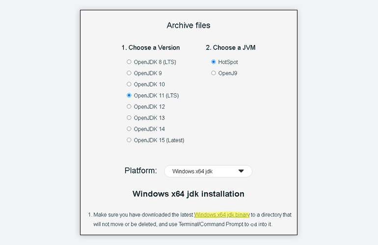
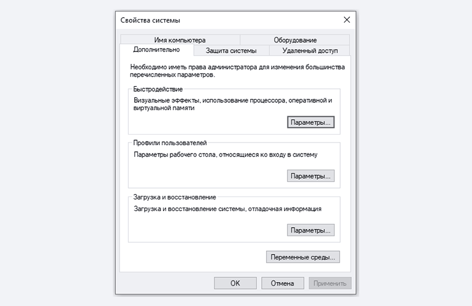
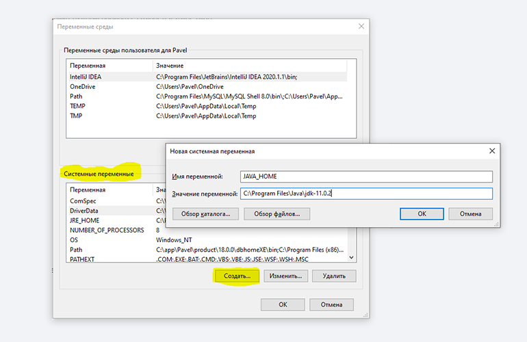
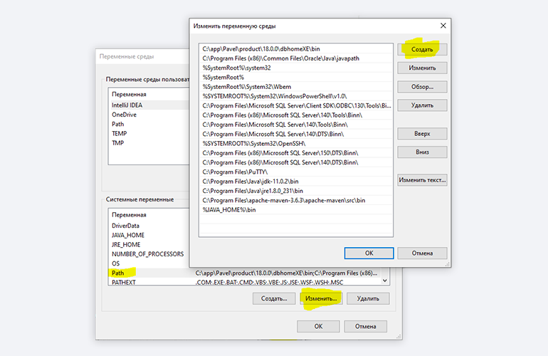
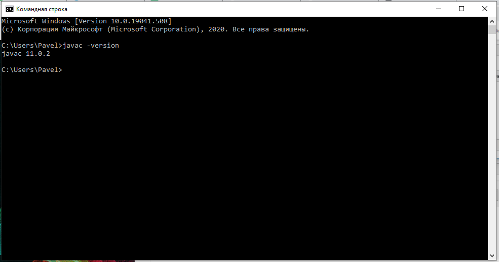

# Установка Java Development Kit в Windows

`Java Development Kit (JDK)` — это комплект ПО для разработчиков приложений на `Java`. Стандартная установка включает в себя интерпретатор, облегчённый интерпретатор `JRE`, компилятор, библиотеку `Java`-классов, отладчик, средства архивации и сжатия `jar` и другое.

Чтобы установить `JDK` в `Windows`, нужно:
* загрузить актуальную версию пакета
* установить его
* настроить переменные окружения
* проверить установку

## 1. Скачиваем установочный архив

Нам нужна бесплатная версия `JDK` — `AdoptOpenJDK`(она есть под `Windows`, `macOS`, `Ubuntu` и другие платформы)

На [сайте разработчика](https://adoptopenjdk.net/installation.html) выбираем версию `JDK` (актуальны версии 8+), виртуальную `Java`-машину (`JVM`) и свою платформу

Выбираем `OpenJDK 11 (LTS)`, `HotSpot` и `Windows x64 jdk` соответственно:

Скачиваем файл по появившейся ссылке (выделено жёлтым на скриншоте выше)

## 2. Устанавливаем

Извлекаем скачанный архив в папку `C:\Program Files\Java\`

При этом будет создана подпапка `jdk-<номер версии>`, а внутри неё появится папка `bin`

В результате полный путь до папки `bin` выглядит так:

`C:\Program Files\Java\jdk-<номер версии>\bin`

## 3. Настраиваем переменные окружения Windows

Нам нужно создать системную переменную `JAVA_HOME`, которая будет хранить путь до нашей версии `JDK`. Это понадобится программам для работы с проектами `Java`.

* Заходим в `Панель управления → Система → Дополнительные параметры системы → Дополнительно -> Переменные среды`
* Либо можно в `Панели управления` вбить в поиск слово `«переменных»`(без кавычек). Из предложенных вариантов выбирайте `«Изменение системных переменных среды»`
* Либо нажимаем `Win + R`, а в появившемся окне вводим `regedit` и жмём на `Enter`

У вас откроется окно:

Здесь жмём на кнопку `«Переменные среды»`

В новом окне для раздела `«Системные переменные»` кликаем `«Создать»`. В `«Имя переменной»` вводим `JAVA_HOME`(именно так, латиницей в верхнем регистре), в поле `«Значение переменной»` подставляем наш путь `C:\Program Files\Java\jdk-<номер версии>`:

Далее в разделе `«Переменные среды пользователя...»` редактируем системную переменную `Path`. Нужно добавить в неё путь к папке с исполняемыми файлами `Java`, а именно: `%JAVA_HOME%\bin`(соблюдайте регистр символов):

После этого необходимо перезагрузить `Windows`

## 4. Проверяем установку

Запускаем `«Командную строку Windows»`. Для этого нажимаем `Win + R`, в появившемся окне вводим `cmd.exe` и жмём на `Enter`

В открывшейся консоли набираем `javac -version` и жмём на `Enter`

Если установка прошла успешно, то ответ в консоли покажет версию вашего компилятора:

